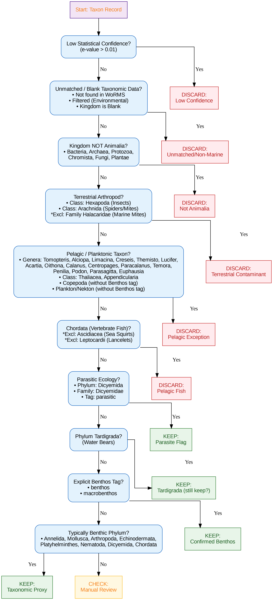
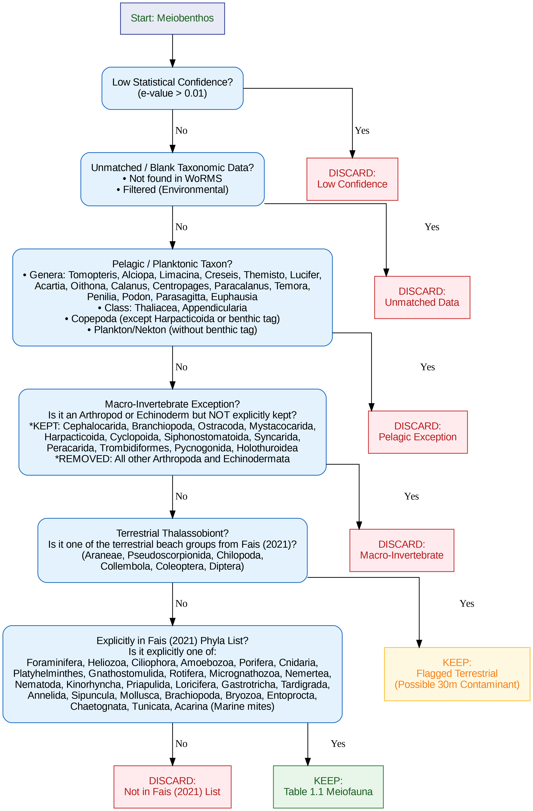

# Benthic Metabarcoding Ecological Filter

This repository contains the standardized filtering logic used to process 16S, 18S, and COI metabarcoding data, specifically optimized for marine benthic ecology. The tool features a **dual-pipeline system** to accurately process and separate **Macrobenthos** and **Meiobenthos** datasets based on established biological criteria.

## 🔗 [Live Interactive Decision Tree (click here)](https://rafael-r-torres.github.io/benthic-metabarcoding-filter/)
*Features a toggleable UI to explore both the Macrobenthic and Meiobenthic sorting paths.*

---

## 📊 Methodology Flowcharts

### Macrobenthos Sorting Pipeline

### Meiobenthos Sorting Pipeline

---

## 🛠 Filtering Logic Overview

Because Macrobenthic and Meiobenthic organisms have vastly different ecological definitions (particularly regarding single-celled protists and miniaturized subgroups), the filter splits into two distinct processing paths:

### 🦀 Path A: Macrobenthos Filter
This 10-step sequence is designed to isolate large, multicellular benthic organisms by removing microscopic fauna, pelagic contaminants, and terrestrial anomalies:
1.  **Statistical Confidence:** Removes low-quality hits (e-value > 0.01).
2.  **Taxonomic Integrity:** Discards sequences not matched in WoRMS or missing Kingdom data.
3.  **Kingdom Check:** Filters out non-Animalia (Bacteria, Archaea, Protozoa, Chromista, Fungi, Plantae).
4.  **Terrestrial Contaminants:** Removes Hexapoda and Arachnida (except marine Halacaridae).
5.  **Pelagic Exceptions:** Removes specific planktonic genera (e.g., *Tomopteris, Calanus*) and pelagic classes/tags.
6.  **Vertebrate Sweep:** Removes Chordata (except benthic Ascidiacea and Leptocardii).
7.  **Parasite Identification:** Flags Dicyemida and parasitic feeding modes.
8.  **Tardigrada Discard:** Removes microscopic Water Bears (Meiofauna exception).
9.  **Benthic Validation:** Confirms taxa with explicit 'benthos' or 'macrobenthos' tags.
10. **Benthic Proxy:** Keeps typically benthic phyla (Annelida, Mollusca, etc.) when ecology tags are missing.

### 🔬 Path B: Meiobenthos Filter
Based explicitly on the authoritative phyla list established in **Table 1.1 of *Meiobenthology* (Giere, 2009)** and adapted for **Fais (2021)**. This pipeline protects crucial single-celled benthic protists while aggressively filtering out plankton and macro-invertebrates.
1.  **Statistical Confidence:** Removes low-quality hits (e-value > 0.01).
2.  **Taxonomic Integrity:** Discards unmatched sequences or environmental filters.
3.  **Pelagic Exceptions:** Removes holoplankton, pelagic genera, and floating copepods (protecting benthic Harpacticoida).
4.  **Macro-Invertebrate Exception:** Discards massive phyla (like Arthropoda and Echinodermata), explicitly saving *only* the miniaturized subgroups listed in Giere's footnotes (e.g., Ostracoda, Holothuroidea).
5.  **Thalassobiont Depth Flag:** Isolates terrestrial beach taxa (e.g., Araneae, Diptera, Collembola) into a "Yellow Flag" bin, as these are highly likely to be environmental contaminants in 30-meter offshore sublittoral samples.
6.  **Explicit Table 1.1 Sweep:** A strict whitelist filter that retains exactly the phyla outlined in Giere (2009) / Fais (2021) as constituting the marine meiobenthos (Foraminifera, Nematoda, Kinorhyncha, etc.).

---

## 💻 Technical Implementation
The filtering logic is visualized via a Python-based Graphviz pipeline and deployed as a responsive, dual-mode interactive HTML application for manual data review and pipeline validation.
